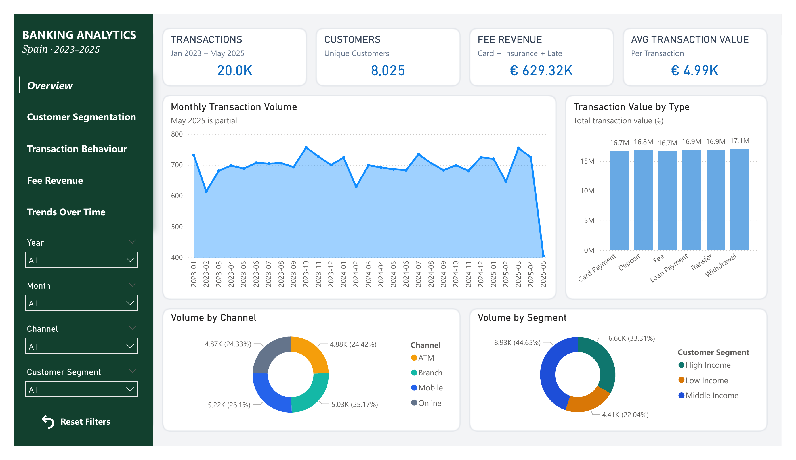
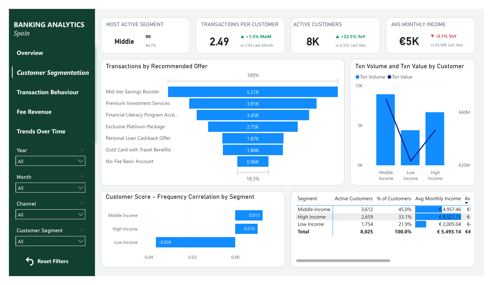
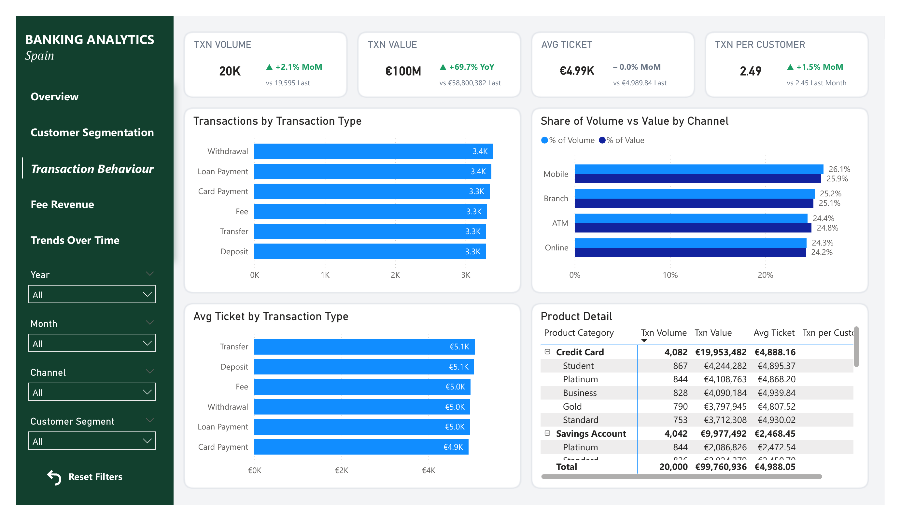
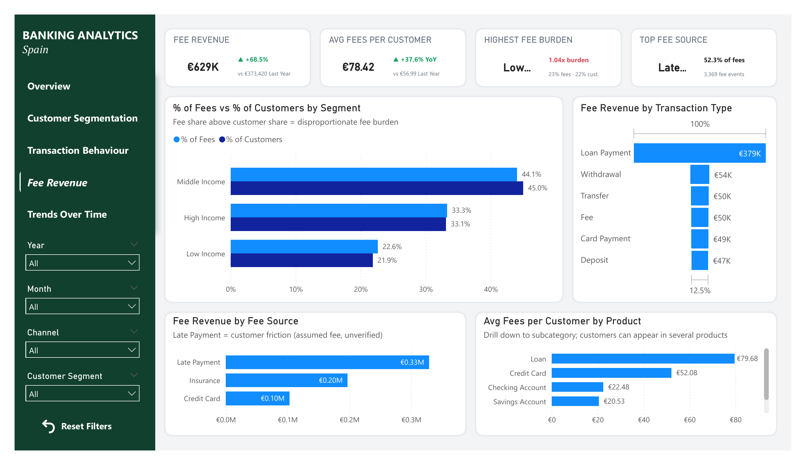
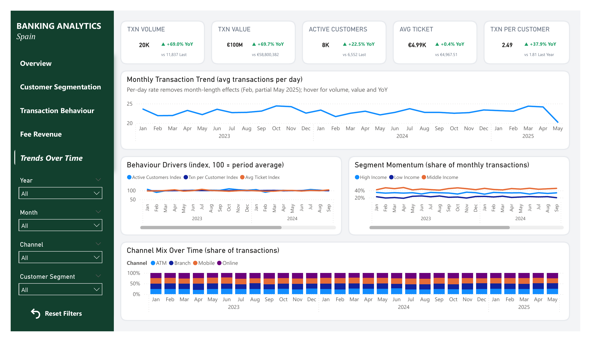
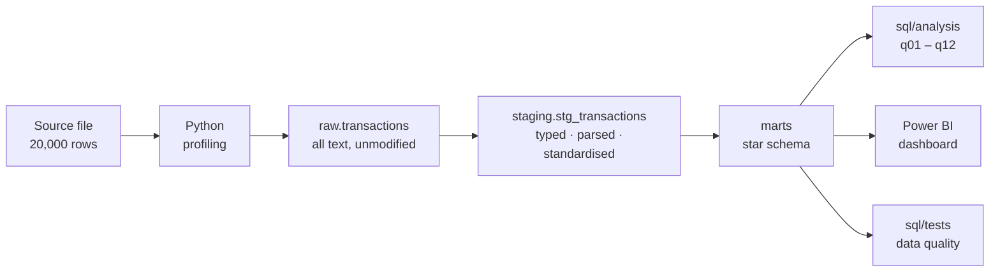

# Banking Transaction Analytics             
Analytics pipeline over 20,000 Spanish retail-banking transactions:                
Python profiling → PostgreSQL (raw → staging → star schema, marts) → SQL analysis → Power BI.              
Answers 12 business questions on customer segmentation, transaction behavior, fee revenue and seasonality.   

  
  
  
  

   
## Dashboard Preview

<table>
<tr>
<td colspan="2" align="center">

 
<b>Page 1 — Overview</b>
</td>
</tr>
<tr>
<td width="50%" align="center">

 
<b>Page 2 — Customer Segmentation</b>
</td>
<td width="50%" align="center">

 
<b>Page 3 — Transaction Behaviour</b>
</td>
</tr>
<tr>
<td width="50%" align="center">

 
<b>Page 4 — Fee Revenue</b>
</td>
<td width="50%" align="center">

 
<b>Page 5 — Trends Over Time</b>
</td>
</tr>
</table>

<em>Click any image to view it full size.</em>

## 1. Business Context              
A retail bank holds transaction-level data across checking accounts, loans, mortgages and card payments, enriched with customer income band, credit score, branch location, channel and the marketing offer assigned to each customer.

The bank wants to use this data to:      
- **Personalise** product recommendations to how customers actually behave
- **Assess** customer-level risk and profitability
- **Refine** marketing campaigns to the segments that respond
- **Optimise** branch and channel performance

### Dataset

| Attribute | Value |
|---|---|
| Records | 20,000 transactions |
| Market | Spain |
| Product lines | Checking accounts, loans, mortgages, card payments |
| Customer attributes | Monthly income, income segment, credit score, recommended offer |
| Transaction attributes | Type, amount, currency, credit-card fees, insurance fees, late-payment amount |
| Operational attributes | Branch city + coordinates, channel (ATM / Mobile / Branch) |
| Time span | ~871 distinct dates |

## 2. Business Questions
Twelve questions in four groups. Each group maps to one SQL file and one dashboard section.            

### Group 1. Customer Segmentation

| No. | Question |
|:---:|---|
| 1 | Which customer segments are the most transaction-active? |
| 2 | Which financial products are preferred within each segment? |
| 3 | Does credit score correlate with transaction frequency or total accumulated fees? |

### Group 2. Transaction Behavior

| No. | Question |
|:---:|---|
| 4 | Which transaction types dominate by volume (count) and by value (amount)? |
| 5 | Which cities or branches are transaction hotspots, and which underperform? |
| 6 | How do usage habits differ across Mobile, ATM and Branch channels? |

### Group 3. Revenue & Cost

| No. | Question |
|:---:|---|
| 7 | Which transaction types generate the most fee revenue (card fees, insurance, late payment)? |
| 8 | Are any customer groups bearing a disproportionate share of fees? |
| 9 | Which friction points recur most often while still generating revenue? |

### Group 4. Trends & Performance         

| No. | Question |
|:---:|---|
| 10 | Are there monthly or seasonal peaks and troughs in transaction activity? |
| 11 | Do recommended offers actually match customer needs and observed behaviour? |
| 12 | Which trends are emerging over time across segments and channels? |

## 3. Question-to-Model Mapping             

Which dimension each question needs. This drove the star schema design — the model was built from the questions.    

| No. | Question | Customer | Date | Branch | Channel | Txn Type | Product |
|:---:|---|:---:|:---:|:---:|:---:|:---:|:---:|
| 1 | Most active segments | ✓ | | | | ✓ | |
| 2 | Product preference by segment | ✓ | | | | | ✓ |
| 3 | Credit score vs fees | ✓ | | | | | |
| 4 | Dominant transaction types | | | | | ✓ | |
| 5 | Branch / city hotspots | | | ✓ | | ✓ | |
| 6 | Channel differences by segment | ✓ | | | ✓ | ✓ | |
| 7 | Fee revenue by transaction type | | | | | ✓ | ✓ |
| 8 | Disproportionate fee burden | ✓ | | | | | ✓ |
| 9 | Friction points driving revenue | ✓ | | | ✓ | | |
| 10 | Seasonality | | ✓ | | | | |
| 11 | Offer vs behavior fit | ✓ | | | | | ✓ |
| 12 | Emerging trends | ✓ | ✓ | | ✓ | | |

## 4. Architecture             

**Three-schema separation** in PostgreSQL:

| Schema | Role | Rule |
|---|---|---|
| `raw` | Landing zone | Loaded as text, never modified. Reproducibility anchor. |
| `staging` | Cleaning | Type casting, date parsing, text standardisation, derived columns (`direction`, `total_fees`, `amount_base`). |
| `marts` | Serving | Star schema. The only layer Power BI and the analysis queries read from. |

### Star Schema Transactions ERD

## 5. Key Findings   
- Transaction activity is broadly stable over time. Monthly activity stays in a relatively narrow range, and the daily transaction trend is mostly flat, with no strong seasonal pattern. The sharp decline in May 2025 should not be interpreted as a true drop because May is only partially observed.
- Middle-income customers are the largest segment and account for roughly 45% of both customers and transaction activity. This suggests that transaction volume is broadly proportional to segment size rather than being dominated by an unusually active segment.
- Transaction behaviour is fairly balanced across channels and transaction types. Channel shares are close to one another, and transaction-type volumes are also similar, indicating no single channel or transaction type dominates overall usage.
- Fee revenue is much more concentrated than transaction activity. Loan Payment generates about €379K in fee revenue, far above the other transaction types, while Late Payment contributes about €0.33M and represents the largest fee source.
- Fee burden is slightly higher for low-income customers. Low-income customers represent about 21.9% of customers but around 22.6% of fees, giving them the highest fee-burden index among the segments. The difference is not extreme, but it is directionally important.
- Customer-segment and channel shares remain quite stable over time. Segment momentum and channel mix do not show major structural shifts, suggesting that recent changes in transaction value are more likely driven by transaction intensity/value than by a large migration between segments or channels.     
## 6. Recommendations      
- Investigate the drivers behind Loan Payment and Late Payment fees. Because fee revenue is highly concentrated in these areas, the bank should determine whether the revenue reflects intentional pricing or customer friction that could affect satisfaction and retention.
- Monitor fee burden for low-income customers. The current imbalance is small, but this segment has the highest relative fee burden. Tracking the metric over time can help detect whether the gap widens.
- Prioritize the middle-income segment for broad engagement initiatives. It is the largest customer segment and contributes the greatest transaction volume, making it the most scalable audience for cross-sell and retention campaigns.
- Avoid over-investing in channel migration based on the current data. Channel shares are relatively stable, so decisions should focus more on improving channel experience and economics rather than assuming a strong shift toward one channel.
- Use transaction-value and activity-driver metrics together. Since customer, frequency, and ticket trends are relatively stable, sudden increases in transaction value should be decomposed into changes in active customers, transaction frequency, and average ticket before drawing conclusions.
- Validate two important data assumptions before production use: whether late_payment_amount truly represents a fee/penalty, and whether recommended offers can be evaluated for effectiveness. The current dataset contains recommended offers but no acceptance or redemption outcome, so offer effectiveness cannot yet be measured directly.    
## 7. Limitations            
- Synthetic / simulated dataset — Dataset provided by Xóm Data for educational purposes.
- `RecommendedOffer` is deterministically derived from income segment, which caps what Q11 can conclude.
- No time-series depth per customer beyond the observed window, so churn and lifetime-value questions are out of scope.
- Single market (Spain); findings do not generalise across regulatory environments.

---
## 💬 Thank you for reading this far!     
I'm always open to Data Analyst opportunities, as well as any feedback that helps the project improve. Feel free to reach out.

**Bùi Thu Hằng** — Data Analyst           
Reach me via [LinkedIn](https://www.linkedin.com/in/buithuhang/) or [Email - buihang.work@gmail.com](https://mail.google.com/mail/?view=cm&fs=1&to=buihang.work@gmail.com).

