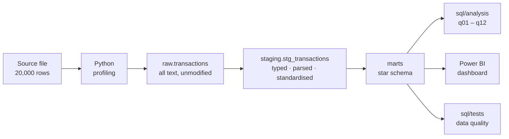
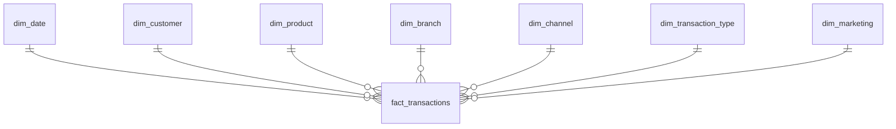

# Banking Transaction Analytics             
Analytics pipeline over 20,000 Spanish retail-banking transactions: Python profiling → PostgreSQL (raw → staging → star schema, marts) → SQL analysis → Power BI. Answers 12 business questions on customer segmentation, transaction behaviour, fee revenue and seasonality.

  
  
  
  

## Dashboard    
<!--
<table>
  <tr>
    <td width="50%" align="center">
      
       <b>Page 1 — Customer &amp; Segment</b>
    </td>
    <td width="50%" align="center">
      
       <b>Page 2 — Transaction Behaviour</b>
    </td>
  </tr>
  <tr>
    <td width="50%" align="center">
      
       <b>Page 3 — Revenue &amp; Cost</b>
    </td>
    <td width="50%"></td>
  </tr>
</table>
-->

## 1. Business Context              
A retail bank holds transaction-level data across checking accounts, loans, mortgages and card payments, enriched with customer income band, credit score, branch location, channel and the marketing offer assigned to each customer.

The bank wants to use this data to:      
- **Personalise** product recommendations to how customers actually behave
- **Assess** customer-level risk and profitability
- **Refine** marketing campaigns to the segments that respond
- **Optimise** branch and channel performance

### Dataset

| Attribute | Value |
|---|---|
| Records | 20,000 transactions |
| Market | Spain |
| Product lines | Checking accounts, loans, mortgages, card payments |
| Customer attributes | Monthly income, income segment, credit score, recommended offer |
| Transaction attributes | Type, amount, currency, credit-card fees, insurance fees, late-payment amount |
| Operational attributes | Branch city + coordinates, channel (ATM / Mobile / Branch) |
| Time span | ~871 distinct dates |

## 2. Business Questions
Twelve questions in four groups. Each group maps to one SQL file and one dashboard section.            

### Group 1. Customer Segmentation

| No. | Question |
|:---:|---|
| 1 | Which customer segments are the most transaction-active? |
| 2 | Which financial products are preferred within each segment? |
| 3 | Does credit score correlate with transaction frequency or total accumulated fees? |

### Group 2. Transaction Behaviour

| No. | Question |
|:---:|---|
| 4 | Which transaction types dominate by volume (count) and by value (amount)? |
| 5 | Which cities or branches are transaction hotspots, and which underperform? |
| 6 | How do usage habits differ across Mobile, ATM and Branch channels? |

### Group 3. Revenue & Cost

| No. | Question |
|:---:|---|
| 7 | Which transaction types generate the most fee revenue (card fees, insurance, late payment)? |
| 8 | Are any customer groups bearing a disproportionate share of fees? |
| 9 | Which friction points recur most often while still generating revenue? |

### Group 4. Trends & Performance         

| No. | Question |
|:---:|---|
| 10 | Are there monthly or seasonal peaks and troughs in transaction activity? |
| 11 | Do recommended offers actually match customer needs and observed behaviour? |
| 12 | Which trends are emerging over time across segments and channels? |

## 3. Question-to-Model Mapping             

Which dimension each question needs. This drove the star schema design — the model was built from the questions, not the other way round.    

| No. | Question | Customer | Date | Branch | Channel | Txn Type | Product |
|:---:|---|:---:|:---:|:---:|:---:|:---:|:---:|
| 1 | Most active segments | ✓ | | | | ✓ | |
| 2 | Product preference by segment | ✓ | | | | | ✓ |
| 3 | Credit score vs fees | ✓ | | | | | |
| 4 | Dominant transaction types | | | | | ✓ | |
| 5 | Branch / city hotspots | | | ✓ | | ✓ | |
| 6 | Channel differences by segment | ✓ | | | ✓ | ✓ | |
| 7 | Fee revenue by transaction type | | | | | ✓ | ✓ |
| 8 | Disproportionate fee burden | ✓ | | | | | ✓ |
| 9 | Friction points driving revenue | ✓ | | | ✓ | | |
| 10 | Seasonality | | ✓ | | | | |
| 11 | Offer vs behaviour fit | ✓ | | | | | ✓ |
| 12 | Emerging trends | ✓ | ✓ | | ✓ | | |

## 4. Architecture             

**Three-schema separation** in PostgreSQL:

| Schema | Role | Rule |
|---|---|---|
| `raw` | Landing zone | Loaded as text, never modified. Reproducibility anchor. |
| `staging` | Cleaning | Type casting, date parsing, text standardisation, derived columns (`direction`, `total_fees`, `amount_base`). |
| `marts` | Serving | Star schema. The only layer Power BI and the analysis queries read from. |

### Star Schema

## 5. Key Findings        
## 6. Recommendations          
## 7. Limitations            
- Synthetic / simulated dataset — figures illustrate methodology, not any real institution's performance.
- `RecommendedOffer` is deterministically derived from income segment, which caps what Q11 can conclude.
- No time-series depth per customer beyond the observed window, so churn and lifetime-value questions are out of scope.
- Single market (Spain); findings do not generalise across regulatory environments.

---

## Author
**Bùi Thu Hằng** — Data Analyst           
Reach me on [LinkedIn](https://www.linkedin.com/in/buithuhang/) or via [Email](mailto:hangbui.bda@gmail.com)
